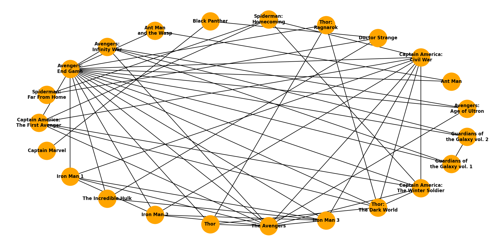
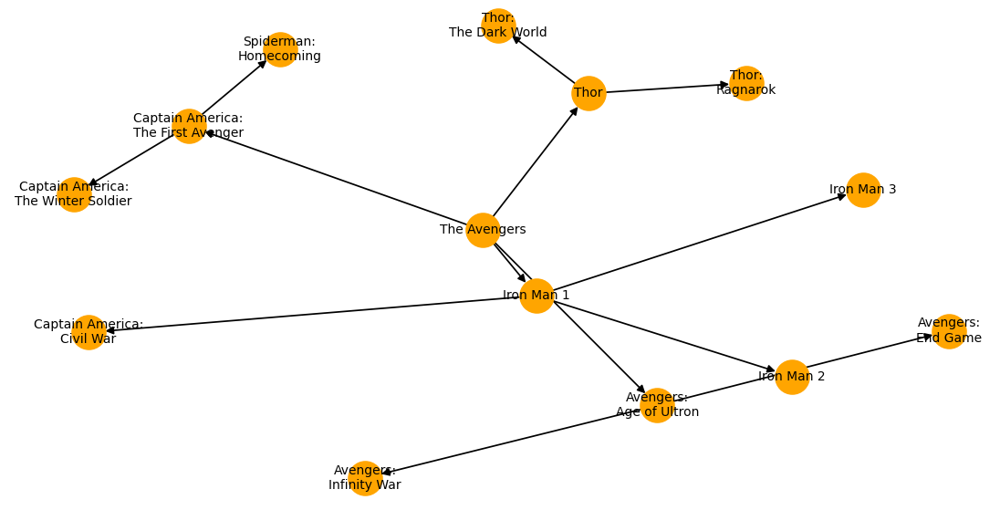
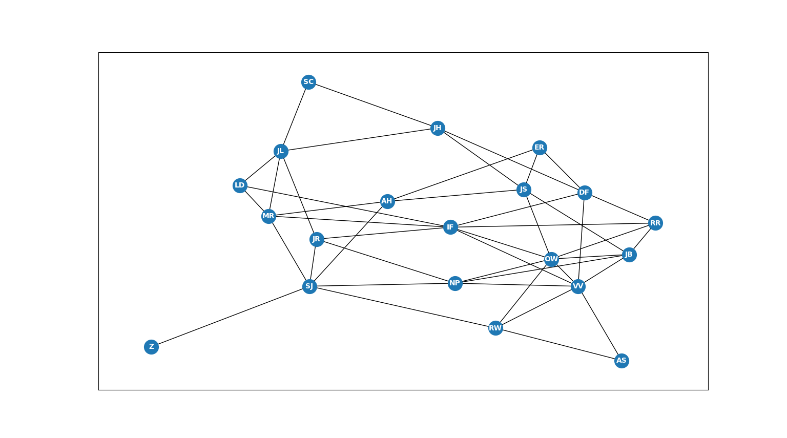
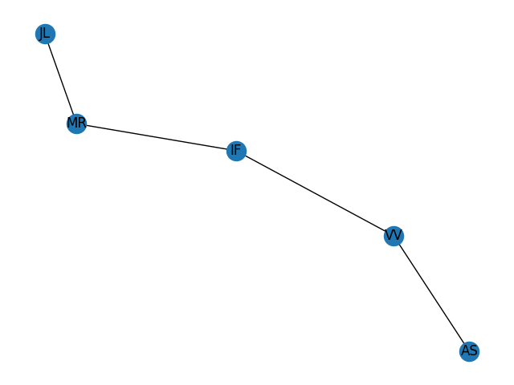

# Graphing with Movies

**CISC320 Spring 2023 Lesson 19 - Graph Applications**

Group Members:
* Kayla Roth : kjroth@udel.edu
* Mercedes Mathews : mmathews@udel.edu
* Sam Glover : sjglover@udel.edu
* Yasmeen Elzamek : yelzamek@udel.edu


In our site, we created 4 different graphs that all revolve around the central concept of Movies. We focused on Dijkstra's Algorithm, Prim's Algorithm, Breadth-first Search, and Depth-first Search.

## Installation Code

```sh
$> pip install networkx
```

## Python Environment Setup

```python
import networkx as nx
import matplotlib.pyplot as plt
```

# Dijkstras Algorithm

**Informal Description**: 
It is the release day for a movie you have been looking forward to for months. You need to get to the movie theater (on 17th street) from your house(on 2nd street). You usually take a longer route because it is prettier but you're running late for the movie and need to figure out the shortest path to get to the theater. 
> **Formal Description**:
>  * Input: A series of edges representing the different travel paths, whose weights represent the time it takes to travel along that particular path. The nodes represent the streets taken on that particular path.
>  * Output: A series of nodes representing the shortest path between second street and seventeenth street 

**Graph Problem/Algorithm**: SSSP


**Setup code**:
```python
Roads = ["1st 2nd {'weight': 6}", "1st 5th {'weight': 8}", "1st 13th {'weight': 3}", "1st 8th {'weight': 13}", "1st 4th {'weight': 7}",
         "2nd 9th {'weight': 1}", "2nd 6th {'weight': 17}", "2nd 15th {'weight': 8}",
         "3rd 18th {'weight': 18}", "3rd 12th {'weight': 3}", "3rd 20th {'weight': 23}", "3rd 5th {'weight': 4}",
         "4th 3rd {'weight': 2}", "4th 16th {'weight': 8}", "4th 19th {'weight': 4}", "4th 10th {'weight': 14}",
         "5th 13th {'weight': 17}", "5th 17th {'weight': 20}", "5th 15th {'weight': 10}", "5th 18th {'weight': 6}",
         "6th 11th {'weight': 3}", "6th 19th {'weight': 5}", "6th 12th {'weight': 2}", "6th 7th {'weight': 8}",
         "7th 14th {'weight': 2}", "7th 8th {'weight': 9}", "7th 20th {'weight': 4}",
         "8th 12th {'weight': 8}", "8th 17th {'weight': 2}",
         "9th 14th {'weight': 4}", "9th 6th {'weight': 11}", "9th 16th {'weight': 10}",
         "10th 20th {'weight': 15}", "10th 11th {'weight': 3}"]

```
**Visualization**:


**Solution code:**
```python
import networkx as nx

G = nx.parse_edgelist(Roads, nodetype=str)
print(nx.dijkstra_path(G, "2nd", "17th", weight = 'weight'))
```

**Output**
```python
['2nd', '9th', '14th', '7th', '8th', '17th']
```
**Interpretation of Results**: The shortest path is to travel from your house on second street and turn onto 9th street. From there you will turn onto 14th street, next onto 7th street, then onto 8th street, and finally you will turn onto 17th street to reach the movie theater.

# Prim's Algorithm

**Informal Description**: You want to recommend some movies to a friend. You know what genre of movies your friend likes. By using your friend's preferences, you want to find the smallest set of movie genres that are connected to each other and that will fit your friend's preferences. 
Each movie genre is given an abbreviation. The abbreviations are as follows:
- A = Animation
- Ac = Action 
- An = Anime 
- B = Biographical 
- C = Comedy 
- Cr = Crime 
- D = Drama 
- Do = Documentary 
- F = Fantasy 
- H = Historical 
- Ho - Horror 
- M = Musical 
- My = Mystery 
- R = Romance 
- S = Satire
- Sc = Sci Fi  
- Sp = Sports
- T = Thriller 
- W = Western 
- Z = Zombie 

> **Formal Description**:
>  * Input: An undirected graph, consisting of movie genres as nodes and the edges represent the similarity between the genres
>  * Output: A Minimum Spanning Tree 

**Graph Problem/Algorithm**: MST


**Setup code**:

```python
G.add_edge("R", "C", weight=2)
G.add_edge("C", "M", weight=1)
G.add_edge("Z", "Ho", weight=2)
G.add_edge("T", "Ho", weight=5)
G.add_edge("D", "R", weight=7)
G.add_edge("D", "Ho", weight=11)
G.add_edge("T", "Ac", weight=9)
G.add_edge("Z", "F", weight=1)
G.add_edge("Cr", "C", weight=8)
G.add_edge("R", "Sp", weight=12)
G.add_edge("A", "D", weight=5)
G.add_edge("Sc", "T", weight=4)
G.add_edge("W", "Ac", weight=2)
G.add_edge("H", "Do", weight=5)
G.add_edge("An", "A", weight=1)
G.add_edge("S", "D", weight=3)
G.add_edge("Do", "W", weight=4)
G.add_edge("My", "Cr", weight=6)
G.add_edge("B", "Do", weight=3)
G.add_edge("T", "F", weight=3)
G.add_edge("B", "My", weight=2)
G.add_edge("Sp", "W", weight=9)
G.add_edge("An", "M", weight=10)
G.add_edge("C", "S", weight=3)
G.add_edge("Sc", "H", weight=8)
G.add_edge("W", "Ho", weight=4)
G.add_edge("B", "A", weight=2)
G.add_edge("An", "Sc", weight=9)
G.add_edge("Cr", "M", weight=14)
G.add_edge("My", "F", weight=15)
G.add_edge("S", "Z", weight=17)
G.add_edge("T", "An", weight=3)
G.add_edge("H", "Sp", weight=4)
G.add_edge("B", "F", weight=7)
G.add_edge("Do", "D", weight=5)
G.add_edge("W", "Z", weight=18)
G.add_edge("C", "Ac", weight=19)

# draw the graph and show it MUST BE THE LAST TWO LINES
pos = nx.spring_layout(G)  # positions for all nodes - seed for reproducibility

# nodes
nx.draw_networkx_nodes(G, pos, node_size=300)

# edges
nx.draw_networkx_edges(G, pos, width=1)

# node labels
nx.draw_networkx_labels(G, pos, font_size=10, font_family="sans-serif", font_weight="bold", font_color="white")
# edge weight labels
edge_labels = nx.get_edge_attributes(G, "weight")
nx.draw_networkx_edge_labels(G, pos, edge_labels, font_size=8)
plt.show()
```

**Visualization**:


**Solution code:**

```python
# Graph
G= nx.minimum_spanning_tree(G, weight='weight', algorithm='prim', ignore_nan=False)
pos = nx.spring_layout(G)
nx.draw(G, pos, with_labels=True)
edge_labels = nx.get_edge_attributes(G, 'weight')
nx.draw_networkx_edge_labels(G, pos, edge_labels)
plt.show()

# Edges 
mst = tree.minimum_spanning_edges(G, algorithm="prim", data=False)
edgelist = list(mst)
print(sorted(sorted(e) for e in edgelist))
```

**Output**

```
[['A', 'An'], ['A', 'B'], ['A', 'D'], ['Ac', 'W'], ['An', 'T'], ['B', 'Do'], ['B', 'My'], ['C', 'M'], ['C', 'R'], ['C', 'S'], ['Cr', 'My'], ['D', 'S'], ['Do', 'H'], ['Do', 'W'], ['F', 'T'], ['F', 'Z'], ['H', 'Sp'], ['Ho', 'Z'], ['Sc', 'T']]
```

**Interpretation of Results**: Depending on what genres your friend likes, you can figure out which genres to recommend to them and which genres to not recommend. 

# Depth-First Search

**Informal Description**: The Marvel franchise is a big one. Fans love coming out to watch the next big movie Marvel comes out with. Some of the most popular characters from the older movies make celebrity appearances in the newer movies! 

> **Formal Description**:
>  * Input: An undirected, unweighed graph with nodes representing the movies and edges connecting movies based on shared characters. 
>  * Output: A spanning tree of all the nodes in the graph that are reachable from an arbitrary root

**Graph Problem/Algorithm**: DFS


**Setup code**:

```python
import matplotlib.pyplot as plt

#DFS: find a path connecting movies with the same actors
movies = nx.Graph()
movies.add_node("Captain America:\nThe First Avenger")
movies.add_node("Captain Marvel")
movies.add_node("Iron Man 1")
movies.add_node("The Incredible Hulk")
movies.add_node("Iron Man 2")
movies.add_node("Thor")
movies.add_node("The Avengers")
movies.add_node("Iron Man 3")
movies.add_node("Thor:\nThe Dark World")
movies.add_node("Captain America:\nThe Winter Soldier")
movies.add_node("Guardians of\nthe Galaxy vol. 1")
movies.add_node("Guardians of\nthe Galaxy vol. 2")
movies.add_node("Avengers:\nAge of Ultron")
movies.add_node("Ant Man")
movies.add_node("Captain America:\nCivil War")
movies.add_node("Doctor Strange")
movies.add_node("Thor:\nRagnarok")
movies.add_node("Spiderman:\nHomecoming")
movies.add_node("Black Panther")
movies.add_node("Ant Man\nand the Wasp") #20
movies.add_node("Avengers:\nInfinity War")
movies.add_node("Avengers:\nEnd Game")
movies.add_node("Spiderman:\nFar From Home")

movies.add_edge("Iron Man 1", "Iron Man 2")
movies.add_edge("Iron Man 2", "Iron Man 3")
movies.add_edge("Iron Man 1", "Iron Man 3")

movies.add_edge("Captain America:\nThe First Avenger", "Captain America:\nThe Winter Soldier")
movies.add_edge("Captain America:\nThe Winter Soldier", "Captain America:\nCivil War")
movies.add_edge("Captain America:\nThe First Avenger", "Captain America:\nCivil War")

movies.add_edge("The Avengers", "Avengers:\nAge of Ultron")
movies.add_edge("The Avengers", "Avengers:\nInfinity War")
movies.add_edge("The Avengers", "Avengers:\nEnd Game")
movies.add_edge("Avengers:\nInfinity War", "Avengers:\nAge of Ultron")
movies.add_edge("Avengers:\nInfinity War", "Avengers:\nEnd Game")
movies.add_edge("Avengers:\nAge of Ultron", "Avengers:\nEnd Game")

movies.add_edge("Thor", "Thor:\nRagnarok")
movies.add_edge("Thor:\nRagnarok", "Thor:\nThe Dark World")
movies.add_edge("Thor", "Thor:\nThe Dark World")

movies.add_edge("Guardians of\nthe Galaxy vol. 1", "Guardians of\nthe Galaxy vol. 2")

movies.add_edge("Ant Man", "Ant Man\nand the Wasp")

movies.add_edge("Spiderman:\nHomecoming", "Spiderman:\nFar From Home")

movies.add_edge("The Incredible Hulk", "Doctor Strange")
movies.add_edge("Captain Marvel", "Black Panther")
movies.add_edge("Doctor Strange", "Black Panther")

movies.add_edge("Spiderman:\nHomecoming", "Captain America:\nCivil War")
movies.add_edge("Spiderman:\nHomecoming", "Captain America:\nThe First Avenger")
movies.add_edge("Spiderman:\nHomecoming", "Captain America:\nThe Winter Soldier")

movies.add_edge("Iron Man 1", "Captain America:\nCivil War")
movies.add_edge("Iron Man 2", "Captain America:\nCivil War")
movies.add_edge("Iron Man 3", "Captain America:\nCivil War")

movies.add_edge("Iron Man 3", "The Incredible Hulk")

movies.add_edge("Captain America:\nCivil War", "Thor:\nThe Dark World")
movies.add_edge("Captain America:\nThe First Avenger", "Thor:\nThe Dark World")
movies.add_edge("Captain America:\nThe Winter Soldier", "Thor:\nThe Dark World")

movies.add_edge("Iron Man 1", "Avengers:\nEnd Game")
movies.add_edge("Iron Man 2", "Avengers:\nEnd Game")
movies.add_edge("Iron Man 3", "Avengers:\nEnd Game")

movies.add_edge("Captain America:\nCivil War", "Avengers:\nEnd Game")
movies.add_edge("Captain America:\nThe First Avenger", "Avengers:\nEnd Game")
movies.add_edge("Captain America:\nThe Winter Soldier", "Avengers:\nEnd Game")

movies.add_edge("Thor", "Avengers:\nEnd Game")
movies.add_edge("Thor:\nRagnarok", "Avengers:\nEnd Game")
movies.add_edge("Avengers:\nEnd Game", "Thor:\nThe Dark World")

movies.add_edge("Avengers:\nEnd Game", "The Incredible Hulk")

movies.add_edge("Avengers:\nEnd Game", "The Incredible Hulk")

movies.add_edge("Avengers:\nEnd Game", "Ant Man")
movies.add_edge("Avengers:\nEnd Game", "The Incredible Hulk")
movies.add_edge("Avengers:\nEnd Game", "Ant Man\nand the Wasp")

movies.add_edge("Avengers:\nEnd Game", "Guardians of\nthe Galaxy vol. 2")
movies.add_edge("Avengers:\nInfinity War", "Guardians of\nthe Galaxy vol. 1")
movies.add_edge("Avengers:\nEnd Game", "Guardians of\nthe Galaxy vol. 1")
movies.add_edge("Avengers:\nInfinity War", "Guardians of\nthe Galaxy vol. 2")

movies.add_edge("Spiderman:\nFar From Home", "Doctor Strange")

movies.add_edge("The Avengers", "Iron Man 1")
movies.add_edge("The Avengers", "Iron Man 2")
movies.add_edge("The Avengers", "Iron Man 3")
movies.add_edge("The Avengers", "Thor")
movies.add_edge("The Avengers", "Captain America:\nCivil War")
movies.add_edge("The Avengers", "Captain America:\nThe First Avenger")
movies.add_edge("The Avengers", "Captain America:\nThe Winter Soldier")
```

**Visualization**:



**Solution code:**

```python
#Traversing graph starting with "The Avengers" as the root and going 2 levels deep
movies = nx.dfs_tree(movies, source="The Avengers", depth_limit=2)

#Printing list of edges/ connections between movies
print(list(movies.edges()))

#Displays resulting spanning tree after traversal
nx.draw(movies, pos=nx.spring_layout(movies), with_labels = True, font_size = 8, node_size = 450, node_color = "orange")
plt.show()
```

**Output**

```
[('The Avengers', 'Avengers:\nAge of Ultron'), ('The Avengers', 'Iron Man 1'), ('The Avengers', 'Thor'), ('The Avengers', 'Captain America:\nThe First Avenger'), ('Avengers:\nAge of Ultron', 'Avengers:\nInfinity War'), ('Avengers:\nAge of Ultron', 'Avengers:\nEnd Game'), ('Iron Man 1', 'Iron Man 2'), ('Iron Man 1', 'Iron Man 3'), ('Iron Man 1', 'Captain America:\nCivil War'), ('Thor', 'Thor:\nRagnarok'), ('Thor', 'Thor:\nThe Dark World'), ('Captain America:\nThe First Avenger', 'Captain America:\nThe Winter Soldier'), ('Captain America:\nThe First Avenger', 
'Spiderman:\nHomecoming')]
```

**Interpretation of Results**: If someone is a real fan of The Avenger movie and would like to watch other movies that have characters those characters in them, this output graph would show them the movies with most characters that are in both movies. 

# Breadth-First Search

**Informal Description**: You really like playing the game six degrees of Kevin Bacon but want to play with your favorite actors. By using your favorite actors, you want to find the smallest path and degree that connects two specific actors. Actors are connected if they have been in a movie together and that is considered one degree.
Each actor is given an abbreviation. The abbreviations are as follows:
- AH - Anne Hathaway
- AS - Adam Sandler
- DF - Dave Franco
- ER - Emma Roberts
- IF - Isla Fisher
- JB - Jason Bateman
- JH - Josh Hutcherson
- JL - Jennifer Lawrence
- JR - Jeremy Renner
- JS - Jason Sudeikis
- LD - Leonardo DiCaprio
- MR - Margot Robbie
- NP - Natalie Portman
- OW - Owen Wilson
- RR - Ryan Reynolds
- RW - Reese Witherspoon
- SC - Sam Claflin
- SJ - Scarlett Johansson
- VV - Vince Vaughn
- Z - Zendaya


> **Formal Description**:
>  * Input: An undirected and unweighted graph, consisting of actors as nodes and the edges represent a movie they both starred in, and take in user's two actors of choice from the list of actors (example below will be using 'AS' and 'JL')
>  * Output: The shortest path and the degree between the two chosen actors

**Graph Problem/Algorithm**: BFS


**Setup code**:

```python
graph = nx.Graph()

# size of figure
plt.figure(figsize=(9,9))

# data for graph
graph.add_edge('JB', 'RR')
graph.add_edge('JB', 'OW')
graph.add_edge('JB', 'VV')
graph.add_edge('JB', 'JS')
graph.add_edge('JB', 'NP')
graph.add_edge('AS', 'VV')
graph.add_edge('AS', 'RW')
graph.add_edge('SJ', 'MR')
graph.add_edge('SJ', 'JR')
graph.add_edge('SJ', 'NP')
graph.add_edge('SJ', 'AH')
graph.add_edge('SJ', 'RW')
graph.add_edge('SJ', 'Z')
graph.add_edge('RR', 'OW')
graph.add_edge('RR', 'IF')
graph.add_edge('RR', 'DF')
graph.add_edge('MR', 'IF')
graph.add_edge('MR', 'JL')
graph.add_edge('MR', 'LD')
graph.add_edge('MR', 'AH')
graph.add_edge('OW', 'VV')
graph.add_edge('OW', 'IF')
graph.add_edge('OW', 'JS')
graph.add_edge('OW', 'NP')
graph.add_edge('OW', 'RW')
graph.add_edge('VV', 'IF')
graph.add_edge('VV', 'NP')
graph.add_edge('VV', 'DF')
graph.add_edge('VV', 'RW')
graph.add_edge('IF', 'JR')
graph.add_edge('IF', 'LD')
graph.add_edge('IF', 'DF')
graph.add_edge('JS', 'ER')
graph.add_edge('JS', 'AH')
graph.add_edge('JS', 'JH')
graph.add_edge('ER', 'DF')
graph.add_edge('ER', 'AH')
graph.add_edge('JL', 'JR')
graph.add_edge('JL', 'LD')
graph.add_edge('JL', 'JH')
graph.add_edge('JL', 'SC')
graph.add_edge('JR', 'NP')
graph.add_edge('DF', 'JH')
graph.add_edge('JH', 'SC')


position = nx.spring_layout(graph)

# nodes
nx.draw_networkx_nodes(graph, position, node_size=400)

# edges
nx.draw_networkx_edges(graph, position, width=1)

# node labels
nx.draw_networkx_labels(graph, position, font_size=10, font_family="sans-serif", font_weight="bold", font_color="white")

plt.show()
```

**Visualization**:



**Solution code:**

```python
start_node = input("Enter the first actors abbreviation: ")
end_node = input("Enter the second actors abbreviation: ")

path = []

bfs_tree = nx.bfs_tree(graph, start_node.upper())
path_nodes = nx.shortest_path(bfs_tree, source=start_node.upper(), target=end_node.upper())

path = []
for i in range(0, len(path_nodes) - 1):
    path.append(path_nodes[i])
    path.append(path_nodes[i+1])

# create a subgraph with shortest path from Adam Sandler and JH
sub = graph.subgraph(path)

# Draw the subgraph using matplotlib
position = nx.spring_layout(graph)
nx.draw(sub, position, with_labels=True)
plt.show()

finalPath = sorted(set(path), key=path.index)
print(finalPath)
print("Smallest Degree: " + str((len(finalPath) - 1)))
```

**Output**

```
Enter the first actors abbreviation: AS
Enter the second actors abbreviation: JL
['AS', 'VV', 'IF', 'MR', 'JL']
Smallest Degree: 4
```

**Interpretation of Results**: The actors we input for this example, Adam Sandler and Jennifer Lawrence, are four degrees of each other based on the connections of actors they have starred in movies with. Adam Sandler was in a movie with Vince Vaughn, Vince Vaughn was in a movie with Isla Fisher, Isla Fisher was in a movie with Margot Robbie, and Margot Robbie was in a movie with Jennifer Lawrence. This would win in the six degrees of Kevin Bacon game since Adam Sandler and Jennifer Lawrence are within six degrees of eachother.